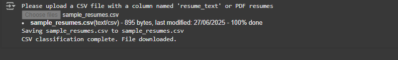
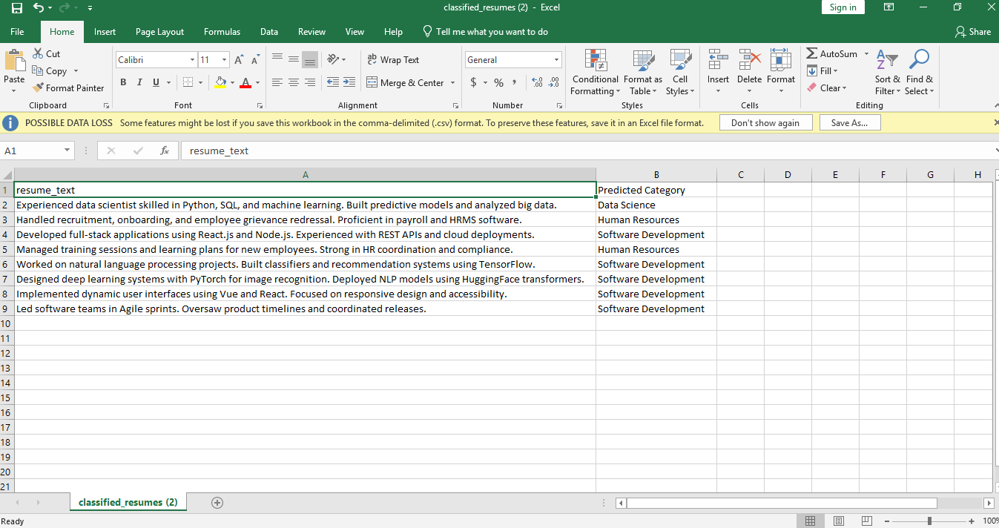

# Resume Screening Assistant

This project uses **FLAN-T5** (a Google transformer model) to automatically classify resumes into categories such as **Data Science**, **Human Resources**, or **Software Development**. It streamlines resume screening using Natural Language Processing (NLP) and is built to run seamlessly on Google Colab.

---

## 🚀 Features
- Classifies resumes from PDF or CSV format
- Uses instruction-tuned FLAN-T5 for prompt-based classification
- Automates resume screening to save HR time and effort
- Outputs downloadable results in CSV format

---

## 🧪 Technologies Used
- Python
- Hugging Face Transformers
- FLAN-T5
- Pandas
- PDFPlumber
- PyTorch
- Google Colab

---

## ▶️ Run in Google Colab

Click below to launch the notebook in Google Colab:  
[](https://colab.research.google.com/drive/1vztbkO0Rp8EeNOFS7q59yxvk5nCFYeAe#scrollTo=Sy6zr79E_PwB&line=7&uniqifier=1)

---

## 📦 Installation

To run locally, install the required packages:

```bash
pip install transformers pandas pdfplumber
```

---

## 📂 Usage

1. Upload resumes as:
   - PDF files *(multiple or single)*
   - A CSV file with a `resume_text` column
2. The system extracts text (from PDFs) or reads from the CSV.
3. Each resume is classified into a job category using FLAN-T5.
4. The predictions are saved and automatically downloaded as a CSV.

---

## 📄 Output Files

- `classified_resumes.csv` – for CSV inputs  
- `pdf_resume_classification.csv` – for PDF inputs

---

## 📃 License

This project is licensed under the **MIT License**.

```
MIT License

Copyright (c) 2025 [Your Name]

Permission is hereby granted, free of charge, to any person obtaining a copy
of this software and associated documentation files (the "Software"), to deal
in the Software without restriction, including without limitation the rights
to use, copy, modify, merge, publish, distribute, sublicense, and/or sell
copies of the Software...
```

---

## 📸 Screenshots

### 📤 Upload Prompt  


### 📤 File Upload  


### 📈 Output CSV Preview  


---

## 🙋‍♂️ Author

- [Nitish kumar Madineni](https://github.com/NitishKumar054)

---

## 🌐 References

- [Hugging Face Transformers](https://huggingface.co/transformers/)
- [FLAN-T5 Model Documentation](https://huggingface.co/google/flan-t5-base)
- [PDFPlumber Library](https://github.com/jsvine/pdfplumber)
- [Google Colab](https://colab.research.google.com/)


